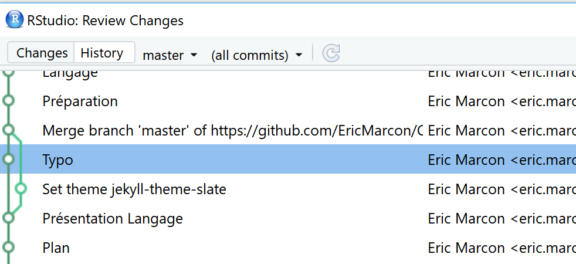

```{r DoNotModify, include=FALSE}
### Utilities. Do not modify.
# Installation of packages if necessary
InstallPackages <- function(Packages) {
  InstallPackage <- function(Package) {
    if (!Package %in% installed.packages()[, 1]) {
      install.packages(Package, repos="https://cran.rstudio.com/")
    }
  }
  invisible(sapply(Packages, InstallPackage))
}

# Basic packages
InstallPackages(c("bookdown", "formatR", "kableExtra", "ragg"))

# Chunk font size hook: allows size='small' or any valid Latex font size in chunk options
def.chunk.hook  <- knitr::knit_hooks$get("chunk")
knitr::knit_hooks$set(chunk = function(x, options) {
  x <- def.chunk.hook(x, options)
  ifelse(options$size != "normalsize", paste0("\n \\", options$size,"\n\n", x, "\n\n \\normalsize"), x)
})
```

```{r Options, include=FALSE}
### Customized options for this document
# Add necessary packages here
Packages <- c("tidyverse")
# Install them
InstallPackages(Packages)

# knitr options
knitr::opts_chunk$set(
  cache=FALSE,    # Cache chunk results
  echo = TRUE,    # Show/Hide R chunks
  warning=FALSE,  # Show/Hide warnings
  message=FALSE,  # Show/Hide messages
  # Figure alignment and size
  fig.align='center', out.width='80%',
  # Graphic devices (ragg_png is better than standard png)
  dev = c("ragg_png", "pdf"),
  # Code chunk format
  tidy=TRUE, tidy.opts=list(blank=FALSE, width.cutoff=50),
  size="scriptsize", knitr.graphics.auto_pdf = TRUE
)
options(width=50)

# ggplot style
library("tidyverse")
theme_set(theme_bw())
theme_update(panel.background=element_rect(fill="transparent", colour=NA),
             plot.background=element_rect(fill="transparent", colour=NA))
knitr::opts_chunk$set(dev.args=list(bg="transparent"))

# Tibbles: 5 lines, fit to slide width
options(tibble.print_min = 5, tibble.width = 50)

# Random seed
set.seed(973)
```


# Principles

## git

git is a source manager:

- Track changes: much more than a backup!
- Ability to go back in time;
- Several competing versions: branches.

## GitHub

GitHub is a collaboration platform based on Git.

- Multiple developers: the end of attached files!
- Presentation of results: GitHub pages;
- Continuous integration: GitHub Actions.


# Installation

## git: install

RStudio must detect Git

```{r, echo=FALSE, out.width='60%'}
knitr::include_graphics("images/r_options.png")
```

Otherwise, install it.

In RStudio, Tools / Global Options set new Terminals to GitBash.


## GitHub

Open an account on GitHub

```{r, echo=FALSE, out.width='60%'}

```


## GitHub security 1

Your computer must be able to write to git.

In RStudio, Tools / Global Options/ Git-SVN, create a new SSH key.

Copy the private key to GitHub, your accounts, Settings, SSH and GPG keys.


## GitHub security 2

Create a GitHub token for CI:

- User account settings;
- Developer Settings > Personal Access Tokens;
- Generate a token, describe it as "git-RStudio" and give it "repo" authorization.

Save the token!

# Practical

## Create a project

From scratch:

- In GitHub:
  - _New Repository_
  - Choose name (no special characters)
  - Do not add anything else

- Copy the URL from _Clone or Download_.

- In RStudio: New project / Version Control / Git, paste the URL.


## Create a project

From an existing RStudio project:

- Put the project under version control:
  - _Tools /Version Control /Project Setup..._
  - Select _Git_.

- Create a repository on GitHub and retrieve its URL: https://github.com/MyAccount/MyRepo.git

- In RStudio Terminal, run :

```
git remote add origin https://github.com/MyAccount/MyRepo.git
git branch -M master
git push -u origin master
```

## Basic operations: filter

Modified files are displayed in the RStudio Git window.

Use .gitignore to hide non-tracked files.


## Basic operations: commit

- Create an R file with one line of code and save it.

After each work session, _Commit_ the result.

Select files to commit.

Enter a clear message: summary on the first line.


## Basic operations: synchronize

_Push_ modifications to GitHub to make them public.

_Pull_ to retrieve changes from GitHub.


## Basic operations: collaborate

Declare a collaborator.

Work with two or more people on the same file.

Content of a work session:

- Pull,
- Modify,
- Commit,
- Push.


## Conflicts

The elementary data is the line.

Conflicting changes imply a conflict.

Minimize conflicts: in a text, one sentence = one line.

In case of conflict, decide which code or text to keep.


## Project tracking

Clock icon in Git window

```{r, echo=FALSE, out.width='80%'}

```


# Practical

## Generate a conflict

Edit the same line of README.md :

- online on GitHub,
- locally.

Commit, Pull, observe the conflict, solve it.

## Collaborate with your neighbor

The neighbor on the left invites the neighbor on the right to GitHub.

Both modify the project.

- Remember to pull before modifying.
- Push quickly to limit conflicts.


# Branches

## Purpose

Modify the project without disturbing its stable state.

Application :

- develop new functionality,
- test it, correct bugs,
- make it visible when finished.


## Create a branch

Click on New Branch

Work in the new branch (pull, commit, push).


## Merge

Move to master branch.

Run:
```
git merge branch_to_merge
```


# Fork and Pull Request

## Fork

Goal: modify someone else's repository

[Fork](https://help.github.com/articles/fork-a-repo/): create a copy of the repository

Start a new branch, modify it.


## Pull Request

Branch integration request: _Pull Request_.

On GitHub.

Dialogue possible.

If accepted, merge branch and delete.


# Write Documents

## Use memoiR

Install the **memoiR** package.

Create a new document with memoiR: Stylish Document.

Knit it to check everything is OK.

## Source Control

Use git with your document.

Create an appropriate `gitignore`: 
```
memoiR::build_gitignore()
```

Store the knitted files into `/docs`
```
memoiR::build_githubpages()
```

Make your first commit.

## Upload to GitHub

Create your repo on GitHub.

Copy the commands to upload an existing git repo:
```
git remote add origin https://github.com/MyAccount/MyRepo.git
git branch -M master
git push -u origin master
```

## Declare repo in header

In the header of your Rmd file, update the repository name and the URL.

Commit.

Add a README:
```
memoiR::build_readme()
```
Commit.

## Continuous integration

On GitHub, your repo, Settings / Secrets and variables / Action :

- Add two secrets:
  - EMAIL: your email address
  - GH_PAT: your personal access token

In RStudio, run
```
memoiR::build_ghworkflow()
```

Commit, Push and look at Actions.
